[README_filled.md](https://github.com/user-attachments/files/32957596/README_filled.md)
# Еловиков Виктор ЛА3 Лабораторная №1

# Задание 1. Методы

## Задача 1. Дробная часть

### Текст задачи

Дана сигнатура метода: `public double fraction(double x);`

Необходимо реализовать метод таким образом, чтобы он возвращал только дробную часть числа x. Подсказка: вещественное число может быть преобразовано к целому путём отбрасывания дробной части.

### Алгоритм решения

1. Принять вещественное число x из консоли.
2. Преобразовать x к целому типу int — при этом дробная часть отбрасывается (получаем целую часть числа).
3. Вычесть из исходного числа x полученную целую часть.
4. Вернуть результат как вещественное число типа double.

Формула: `fraction(x) = x - (int)x`.

### Тестирование

- Ввод: 5,25 → Вывод: Результат: 0,25
- Ввод: -3,7 → Вывод: Результат: -0,7


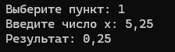
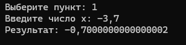

## Задача 2. Букву в число

### Текст задачи

Дана сигнатура метода: `public int charToNum(char x);`

Метод принимает символ x, который представляет собой один из символов «0 1 2 3 4 5 6 7 8 9». Необходимо реализовать метод таким образом, чтобы он преобразовывал символ в соответствующее число. Подсказка: код символа '0' — это число 48.

### Алгоритм решения

1. Принять из консоли один символ и проверить, что это цифра от '0' до '9'.
2. Воспользоваться тем, что код символа '0' равен 48, а код символа '3' равен 51. Тогда нужное число — это разность кода введённого символа и кода символа '0'.
3. Вернуть полученное целое число.

Формула: `charToNum(x) = x - '0'`.

### Тестирование

- Ввод: 3 → Вывод: Результат: 3
- Ввод: 7 → Вывод: Результат: 7


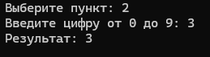

## Задача 3. Двузначное

### Текст задачи

Дана сигнатура метода: `public bool is2Digits(int x);`

Необходимо реализовать метод таким образом, чтобы он принимал число x и возвращал true, если оно двузначное.

### Алгоритм решения

1. Принять число x из консоли.
2. Если x отрицательное — заменить его на противоположное (взять модуль), так как знак числа не влияет на количество знаков.
3. Проверить, попадает ли полученное число в диапазон от 10 до 99 включительно.
4. Вернуть результат проверки: true, если число двузначное, иначе false.

### Тестирование

- Ввод: 32 → Вывод: Результат: True
- Ввод: 516 → Вывод: Результат: False
- Ввод: -45 → Вывод: Результат: True


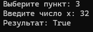
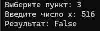

## Задача 4. Диапазон

### Текст задачи

Дана сигнатура метода: `public bool isInRange(int a, int b, int num);`

Метод принимает левую и правую границу (a и b) некоторого числового диапазона. Необходимо реализовать метод таким образом, чтобы он возвращал true, если num входит в указанный диапазон (включая границы). Отношение a и b заранее неизвестно.

### Алгоритм решения

1. Принять из консоли три целых числа: a, b, num.
2. Определить минимум и максимум из a и b, так как заранее неизвестно, какая граница левая, а какая правая.
3. Проверить, что num больше или равен минимуму и меньше или равен максимуму.
4. Вернуть результат проверки.

### Тестирование

- Ввод: a = 5, b = 1, num = 3 → Вывод: Результат: True
- Ввод: a = 2, b = 15, num = 33 → Вывод: Результат: False

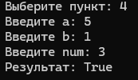
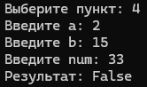

## Задача 5. Равенство

### Текст задачи

Дана сигнатура метода: `public bool isEqual(int a, int b, int c);`

Необходимо реализовать метод таким образом, чтобы он возвращал true, если все три полученных методом числа равны.

### Алгоритм решения

1. Принять из консоли три целых числа: a, b, c.
2. Проверить, что a равно b и b равно c одновременно.
3. Вернуть результат проверки.

### Тестирование

- Ввод: a = 3, b = 3, c = 3 → Вывод: Результат: True
- Ввод: a = 2, b = 15, c = 2 → Вывод: Результат: False

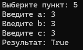
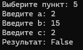

# Задание 2. Условия

## Задача 1. Модуль числа

### Текст задачи

Дана сигнатура метода: `public int abs(int x);`

Необходимо реализовать метод таким образом, чтобы он возвращал модуль числа x (если оно было положительным, то таким и остаётся; если оно было отрицательным — то необходимо вернуть его без знака минус).

### Алгоритм решения

1. Принять целое число x из консоли.
2. Если x меньше нуля — вернуть число с противоположным знаком (-x).
3. Иначе вернуть само число x.

### Тестирование

- Ввод: 5 → Вывод: Результат: 5
- Ввод: -3 → Вывод: Результат: 3

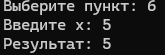
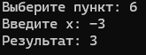


## Задача 2. Тридцать пять

### Текст задачи

Дана сигнатура метода: `public bool is35(int x);`

Необходимо реализовать метод таким образом, чтобы он возвращал true, если число x делится нацело на 3 или 5. При этом, если оно делится и на 3, и на 5, то вернуть надо false.

### Алгоритм решения

1. Принять число x из консоли.
2. Проверить, делится ли x на 3 (остаток от деления равен 0) — переменная del3.
3. Проверить, делится ли x на 5 — переменная del5.
4. Если x делится и на 3, и на 5 одновременно — вернуть false.
5. Иначе вернуть результат логического ИЛИ: делится ли x хотя бы на одно из чисел.

### Тестирование

- Ввод: 5 → Результат: True
- Ввод: 8 → Результат: False
- Ввод: 15 → Результат: False
- Ввод: 9 → Результат: True

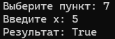
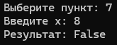

## Задача 3. Тройной максимум

### Текст задачи

Дана сигнатура метода: `public int max3(int x, int y, int z);`

Необходимо реализовать метод таким образом, чтобы он возвращал максимальное из трёх полученных методом чисел.

### Алгоритм решения

1. Принять три целых числа: x, y, z.
2. Предположить, что максимум — это x. Записать его в переменную max.
3. Если y больше max — записать в max значение y.
4. Если z больше max — записать в max значение z.
5. Вернуть переменную max.

### Тестирование

- Ввод: 5, 7, 7 → Результат: 7
- Ввод: 8, -1, 4 → Результат: 8
- Ввод: -5, -2, -10 → Результат: -2

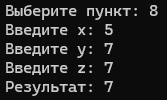
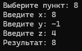


## Задача 4. Двойная сумма

### Текст задачи

Дана сигнатура метода: `public int sum2(int x, int y);`

Необходимо реализовать метод таким образом, чтобы он возвращал сумму чисел x и y. Однако, если сумма попадает в диапазон от 10 до 19, то надо вернуть число 20.

### Алгоритм решения

1. Принять два целых числа x и y.
2. Найти их сумму и записать в переменную sum.
3. Если sum находится в диапазоне от 10 до 19 включительно — вернуть 20.
4. Иначе вернуть sum.

### Тестирование

- Ввод: 5, 7 → Результат: 20
- Ввод: 8, -1 → Результат: 7
- Ввод: 10, 15 → Результат: 25

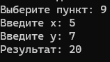
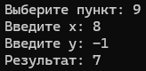

## Задача 5. День недели

### Текст задачи

Дана сигнатура метода: `public String day(int x);`

Метод принимает число x, обозначающее день недели. Необходимо реализовать метод таким образом, чтобы он возвращал строку, которая будет обозначать текущий день недели, где 1 — это понедельник, а 7 — воскресенье. Если число не от 1 до 7, то вернуть текст «это не день недели». Вместо if в данной задаче используйте switch.

### Алгоритм решения

1. Принять число x из консоли с проверкой: от 1 до 7.
2. С помощью конструкции switch по значению x вернуть название соответствующего дня недели.
3. В случае default (число вне диапазона) — вернуть строку «это не день недели».

### Тестирование

- Ввод: 5 → Результат: пятница
- Ввод: 1 → Результат: понедельник

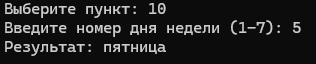
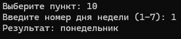


# Задание 3. Циклы

## Задача 1. Числа подряд

### Текст задачи

Дана сигнатура метода: `public String listNums(int x);`

Необходимо реализовать метод таким образом, чтобы он возвращал строку, в которой будут записаны все числа от 0 до x включительно.

### Алгоритм решения

1. Принять число x (неотрицательное).
2. Создать пустую строку result.
3. В цикле for от 0 до x включительно добавлять текущее число в строку, разделяя числа пробелами.
4. Вернуть полученную строку.

### Тестирование

- Ввод: 5 → Результат: 0 1 2 3 4 5
- Ввод: 0 → Результат: 0

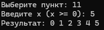
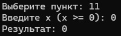

## Задача 2. Чётные числа

### Текст задачи

Дана сигнатура метода: `public String chet(int x);`

Необходимо реализовать метод таким образом, чтобы он возвращал строку, в которой будут записаны все чётные числа от 0 до x включительно. Инструкцию if использовать не следует.

### Алгоритм решения

1. Принять число x (неотрицательное).
2. Создать пустую строку result.
3. В цикле for идти с шагом 2 (начиная от 0): `for (int i = 0; i <= x; i += 2)`.
4. Добавлять в строку значения i, разделяя их пробелами.
5. Вернуть полученную строку.

Благодаря шагу 2 инструкция if для проверки чётности не требуется.

### Тестирование

- Ввод: 9 → Результат: 0 2 4 6 8
- Ввод: 10 → Результат: 0 2 4 6 8 10

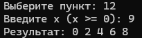
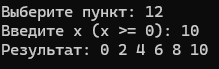

## Задача 3. Длина числа

### Текст задачи

Дана сигнатура метода: `public int numLen(long x);`

Необходимо реализовать метод таким образом, чтобы он возвращал количество знаков в числе x.

### Алгоритм решения

1. Принять число x типа long (неотрицательное).
2. Если x равен 0 — вернуть 1 (число 0 состоит из одного знака).
3. Создать счётчик count = 0.
4. Пока x больше нуля: увеличивать count на 1 и делить x нацело на 10 (отбрасываем последнюю цифру).
5. Вернуть count.

### Тестирование

- Ввод: 12567 → Результат: 5
- Ввод: 0 → Результат: 1
- Ввод: 1000000 → Результат: 7

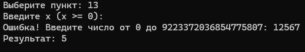
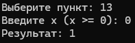

## Задача 4. Квадрат

### Текст задачи

Дана сигнатура метода: `public void square(int x);`

Необходимо реализовать метод таким образом, чтобы он выводил на экран квадрат из символов '*' размером x, у которого x символов в ряд и x символов в высоту.

### Алгоритм решения

1. Принять число x (не меньше 1).
2. Внешний цикл for от 0 до x - 1 — по строкам.
3. Внутренний цикл for от 0 до x - 1 — по столбцам, на каждой итерации вывести '*' без перевода строки.
4. После внутреннего цикла выполнить `Console.WriteLine()` для перехода на новую строку.

### Тестирование

Ввод: 2

```
**
**
```

Ввод: 4

```
****
****
****
****
```
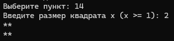
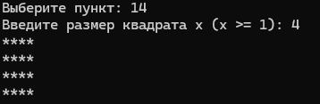

## Задача 5. Правый треугольник

### Текст задачи

Дана сигнатура метода: `public void rightTriangle(int x);`

Необходимо реализовать метод таким образом, чтобы он выводил на экран треугольник из символов '*' высотой x, в котором количество символов в ряду совпадает с номером строки, а сам треугольник выровнен по правому краю. Подсказка: перед символами '*' следует выводить нужное количество пробелов.

### Алгоритм решения

1. Принять число x (не меньше 1).
2. Внешний цикл for от 1 до x — номер строки i.
3. Внутренний цикл — вывести x - i пробелов.
4. Второй внутренний цикл — вывести i символов '*'.
5. Перейти на новую строку.

### Тестирование

Ввод: 3

```
*
**
***
```

Ввод: 4

```
*
**
***
****
```
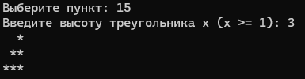
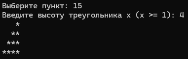


# Задание 4. Массивы

## Задача 1. Поиск первого значения

### Текст задачи

Дана сигнатура метода: `public int findFirst(int[] arr, int x);`

Необходимо реализовать метод таким образом, чтобы он возвращал индекс первого вхождения числа x в массив arr. Если число не входит в массив — возвращается -1.

### Алгоритм решения

1. Принять массив целых чисел и число x.
2. Пройти по массиву в цикле for от 0 до arr.Length - 1.
3. Если текущий элемент равен x — вернуть его индекс i.
4. Если цикл завершился и совпадений не найдено — вернуть -1.

### Тестирование

- Ввод: arr = [1,2,3,4,2,2,5], x = 2 → Результат: 1
- Ввод: arr = [1,2,3], x = 7 → Результат: -1

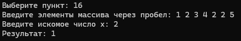
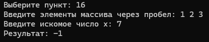

## Задача 2. Поиск максимального по модулю

### Текст задачи

Дана сигнатура метода: `public int maxAbs(int[] arr);`

Необходимо реализовать метод таким образом, чтобы он возвращал наибольшее по модулю (без учёта знака) значение массива arr.

### Алгоритм решения

1. Принять массив целых чисел.
2. За начальный максимум принять первый элемент массива arr[0].
3. Пройти по массиву начиная с индекса 1.
4. Для каждого элемента вычислить его модуль (при необходимости взять противоположное число). Сравнить модуль текущего элемента с модулем найденного максимума.
5. Если модуль текущего элемента больше — обновить максимум.
6. Вернуть найденный элемент (именно элемент, а не его модуль, как в примере: -7).

### Тестирование

- Ввод: arr = [1,-2,-7,4,2,2,5] → Результат: -7
- Ввод: arr = [3, -10, 5] → Результат: -10

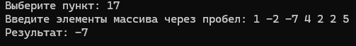
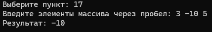


## Задача 3. Добавление массива в массив

### Текст задачи

Дана сигнатура метода: `public int[] add(int[] arr, int[] ins, int pos);`

Необходимо реализовать метод таким образом, чтобы он возвращал новый массив, который будет содержать все элементы массива arr, однако в позицию pos будут вставлены значения массива ins.

### Алгоритм решения

1. Принять два массива arr и ins и число pos (от 0 до arr.Length).
2. Создать новый массив result длиной arr.Length + ins.Length.
3. Скопировать элементы arr с индексами от 0 до pos - 1 в начало массива result.
4. Скопировать все элементы массива ins в позиции начиная с pos.
5. Скопировать оставшиеся элементы массива arr (с индексами от pos до конца) в конец результирующего массива.
6. Вернуть новый массив.

### Тестирование

- Ввод: arr = [1,2,3,4,5], ins = [7,8,9], pos = 3 → Результат: [1, 2, 3, 7, 8, 9, 4, 5]
- Ввод: arr = [1,2], ins = [9], pos = 0 → Результат: [9, 1, 2]

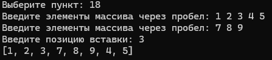
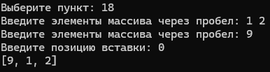

## Задача 4. Возвратный реверс

### Текст задачи

Дана сигнатура метода: `public int[] reverseBack(int[] arr);`

Необходимо реализовать метод таким образом, чтобы он возвращал новый массив, в котором значения массива arr записаны задом наперёд.

### Алгоритм решения

1. Принять массив целых чисел arr.
2. Создать новый массив result той же длины.
3. В цикле for по индексу i от 0 до arr.Length - 1 записывать в result[i] элемент arr[arr.Length - 1 - i].
4. Вернуть новый массив.

Исходный массив не изменяется.

### Тестирование

- Ввод: arr = [1,2,3,4,5] → Результат: [5, 4, 3, 2, 1]
- Ввод: arr = [10, 20] → Результат: [20, 10]

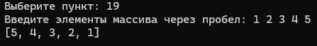
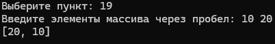

## Задача 5. Все вхождения

### Текст задачи

Дана сигнатура метода: `public int[] findAll(int[] arr, int x);`

Необходимо реализовать метод таким образом, чтобы он возвращал новый массив, в котором записаны индексы всех вхождений числа x в массив arr.

### Алгоритм решения

1. Принять массив целых чисел arr и число x.
2. Первым проходом посчитать, сколько раз x встречается в массиве — переменная count.
3. Создать результирующий массив result длиной count.
4. Вторым проходом заполнить массив result индексами элементов, равных x. Использовать переменную index для отслеживания позиции в результирующем массиве.
5. Вернуть массив result.

### Тестирование

- Ввод: arr = [1,2,3,8,2,2,9], x = 2 → Результат: [1, 4, 5]
- Ввод: arr = [5,5,5], x = 5 → Результат: [0, 1, 2]

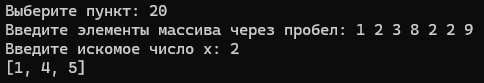
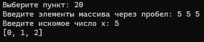
